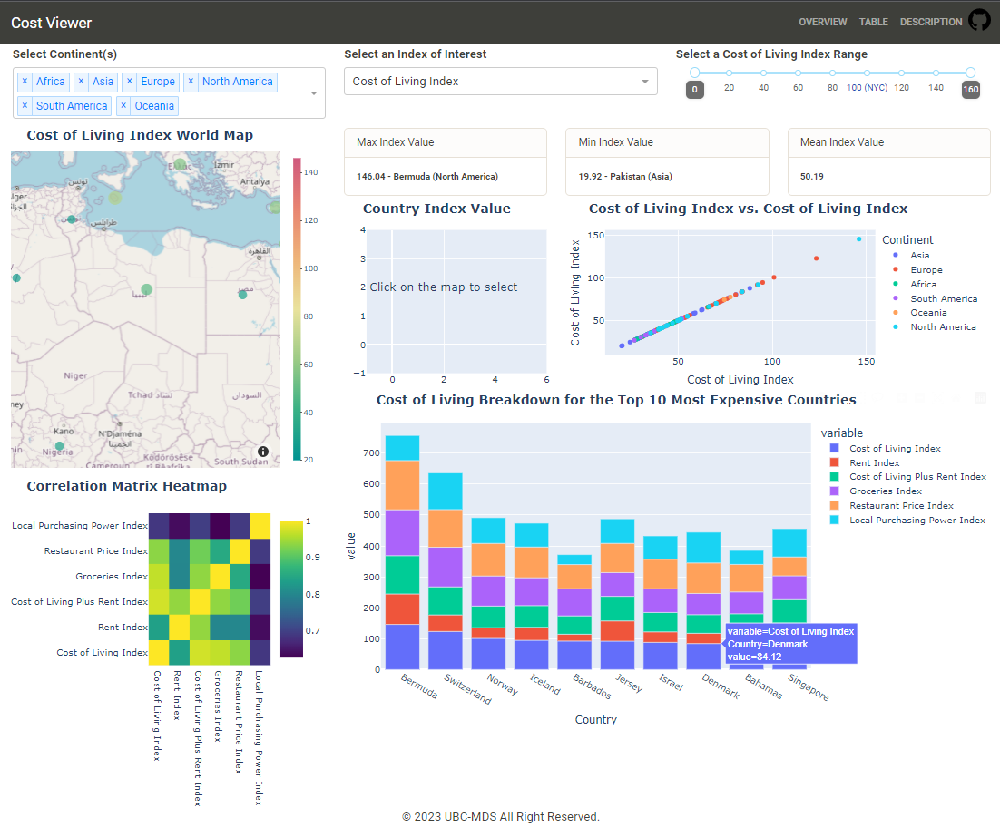
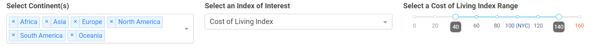
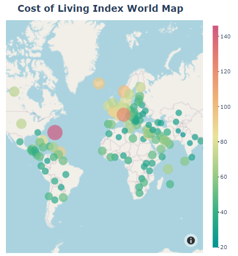
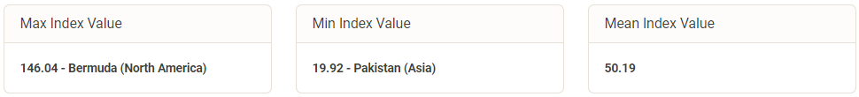
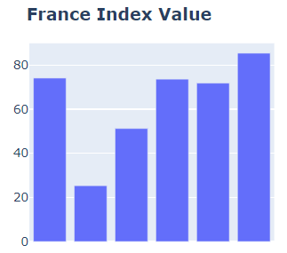
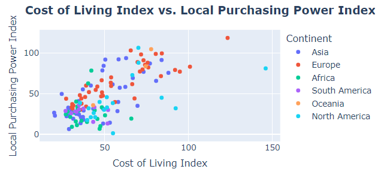
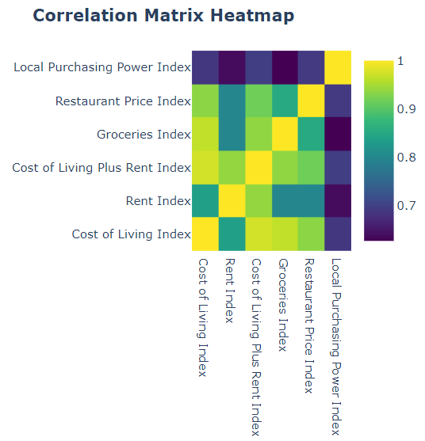
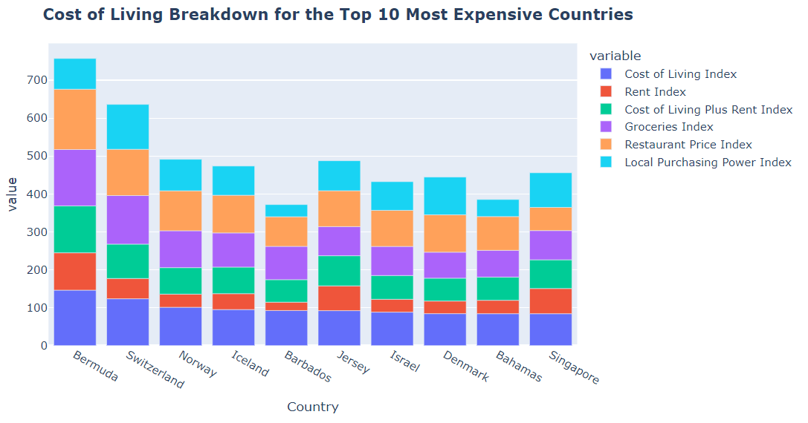
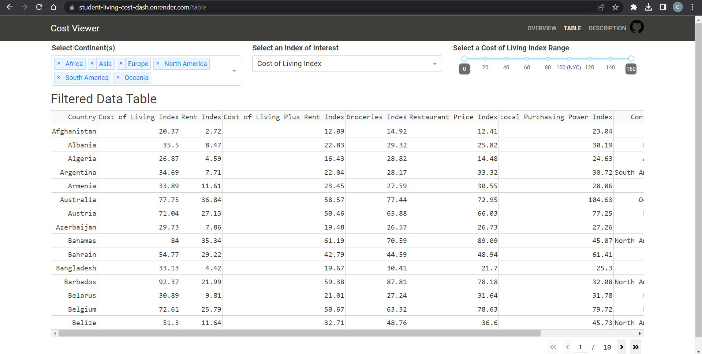
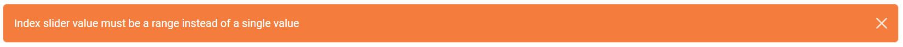

# Student_Living_Guide_Dash

The [Student Living Guide](https://student-living-cost-dash.onrender.com) app is created to help students studying in New York who are looking to explore new countries to travel to during their vacations or to move to after graduating. We have information about the cost of living in different countries in the form of different indexes which we will make available in our app in a very user-friendly and understandable format through a dashboard!

## Proposal

This dashboard aims to provide guidance on the living cost in 2022 and its main target audience is New York students who are looking for a place to travel or continue their studies. Please find more information from our [proposal](https://github.com/UBC-MDS/Student_Living_Guide/blob/main/reports/proposal.md).

## Usage

There are three filters the clients can interactive with, they can filter the data by continents, focus on a specific index of interest, and choose the data by the index range.

The first visualization is a world map with the country's scatter point and the index of interest as the color and size of the point. The color bar on the right provides an easy interpretation of the index value corresponding to a color.

The data card KPI shows the country with a max index value and min index value for the client to quickly find out which country is the most and least expensive to live in. The mean index value offers an overview of KPI for the filtered countries.

By clicking the scatter point on the world map, the client can view all the indices values of this country of interest. Note that, the index name will only show when the client hovers each bar.

The scatter point illustrates the relationship between two specific indices. The X-axis is fixed with the cost of living index, while the Y-axis is changeable by the client.

The correlation matrix heatmap shows the correlation between different indices on the filtered data selected by the client using the filtering widgets on the top.

The stacked bar plot offers an overview of the top N (10 by default) most expensive countries to live in according to the index of interest.

The [table view](https://student-living-cost-dash.onrender.com/table) provides a data table of all the data that satisfy the filtering condition on the top.

If none of the continents are selected, the app will enforce selecting all the continents by default to show all the data.

If the client slides two index values to a single value, the app will enforce increasing or decreasing one of the sliders to the next step value.

## Contributions

Interested in contributing? Please check out our [contributors' guidelines](CONTRIBUTING.md).

It is important to maintain a welcoming and respectful environment while you contribute to the project. Before contributing, please take a moment to review the [code of conduct](CODE_OF_CONDUCT.md) to ensure that your contributions align with our values.

## License

Licensed under the terms of the MIT license.

## Reference

The cost of living dataset used in this dashboard is taken from [Numbeo.com](https://www.numbeo.com/cost-of-living/rankings.jsp).
